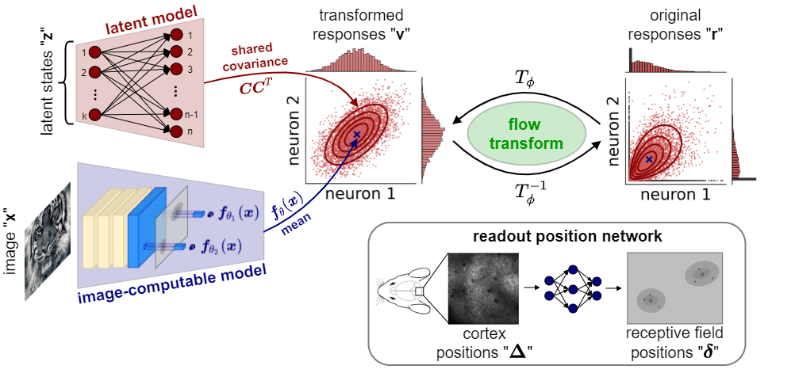

# A Flow-based latent state generative model of neural population responses to natural images

-A000D1.svg)
[](https://youtu.be/pBkFgDrsDrc)
[](https://youtu.be/pPLN9Y5sq0Y)
[](https://www.biorxiv.org/content/10.1101/2021.09.09.459570v1)


Code for "A Flow-based latent state generative model of neural population responses to natural images".

<p align="center">
  
</p>

Here we provide the code used to train and evaluate models presented in the paper, along with three example notebooks in the `notebooks` directory to faciliate code usage:
- `neural_data_demo.ipynb`: this notebook includes an example figure of how the learned transformation trained on neural responses compare to other fixed transformations (i.e. sqrt and anscombe), similar to Fig 2b. It also includes code to run the flow-based as well as the control models (Poisson and ZIG) upon dataset availability.
- `simulate_responses_for_arbitrary_input.ipynb`: this notebook shows how to generate simulated responses for an arbitrary image, given a model trained on neural responses.
- `synthetic_data_demo.ipynb`: this notebook shows how the synthetic data was generated and includes a demo of training a flow-based model on the synthetic data.

## Requirements
- `docker` and `docker-compose`.

## Intructions to run the code

1. Clone the repository: `git clone https://github.com/sinzlab/bashiri-et-al-2021.git`
2. Navigate to the project directory: `cd bashiri-et-al-2021`
3. Run the following command inside the directory

    ```bash
    docker-compose run -d -p 10101:8888 jupyterlab
    ```
    This will create a docker image followed by a docker container from that image in which we can run the code. 

3. You can now open the [jupyter lab evironment](https://jupyterlab.readthedocs.io/en/stable/#) in your browser via `localhost:10101`
